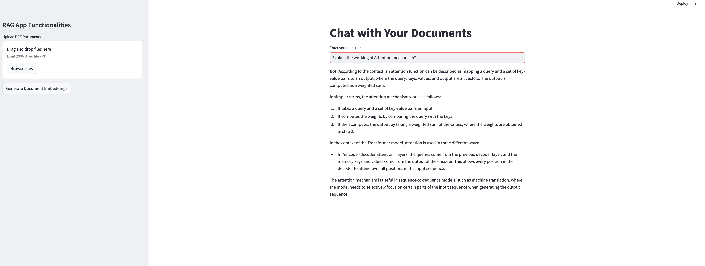

# RAG Chatbot using NVIDIA NIM

A simple Streamlit-based chatbot application that allows users to interact with their documents using a Retrieval-Augmented Generation (RAG) pipeline. Upload your PDF files, generate embeddings, and chat with the documents to get precise answers to your queries.

## Demo



## Features
- ``Document Upload``: Upload one or multiple PDF documents for processing.
- ``Document Embeddings``: Generate embeddings for the uploaded documents using NVIDIA embeddings.
- ``Chat Interface``: Ask questions and receive context-aware answers from your documents.
- ``Streamlined Workflow``: Perform the entire workflow in a simple and clean user interface.

## How to Use
``Upload Documents (Optional):``

- Use the file uploader in the sidebar to upload your custom PDF documents. 
- If no documents are uploaded, the app will process documents from the default ``./data`` directory.

``Generate Document Embeddings:``

- Click the "Generate Document Embeddings" button in the sidebar to process the documents.
- This step prepares the documents for querying.

``Ask Questions:``

- Type your question in the input box and press Enter.
- The bot will provide a context-aware answer based on your documents.

``Repeat:``

- Ask more questions as needed. The bot will respond to each query dynamically.

## PRequirements
- Python 3.9 or higher
- Streamlit
- NVIDIA LangChain integration
- Additional Python dependencies listed in ``requirements.txt``

## Installation

1. **Clone the repository:**
```bash
   git clone https://github.com/SurajBhar/rag_nim.git
   cd rag_nim
```

2. **Set up a virtual environment:**
```bash
   conda create -p nim_env python==3.10
   conda activate nim_env
```

3. **Install Dependencies:**
```bash
   pip install -r requirements.txt
```

4. **Set up your NVIDIA API Key:**
- Create a .env file in the root directory.
- Add your NVIDIA API key to the ``.env ``file:
```bash
   NVIDIA_API_KEY='your_api_key'
```

5. **Run the application:**
- There are different versions of the chatbot available in this repo:
- To run a simple one:
```bash
   streamlit run rag_chatbot_1.py
```
- To run a more complex (under develeopment phase) chatbot:
```bash
   streamlit run complex_rag_chatbot.py
```

## Directory Structure
```
rag_nim/
├── chatbot.py               # Main application file
├── .env                  # Environment variables (API key)
├── data/                 # Default directory for PDF documents
├── complex_rag_chatbot.py # Other version of the chatbot
├── requirements.txt     # Dependencies
└── README.md            # Project documentation
└── demo.png             # Project demonstration


```

# Contributing
Contributions are welcome! Feel free to fork this repository and submit pull requests for enhancements or bug fixes.

